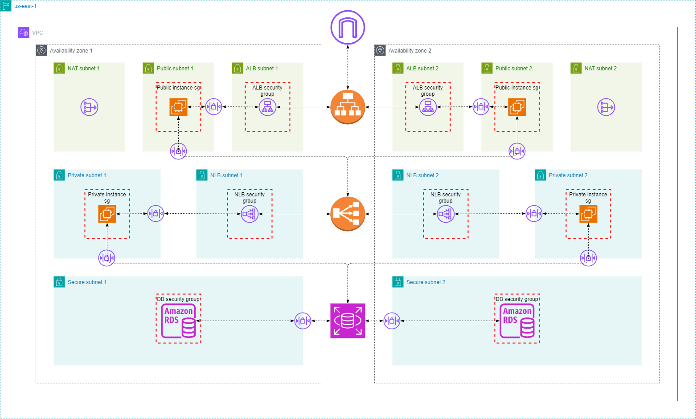

# AWS 3-Tier Infrastructure using Terraform

This Terraform project provisions a **3-tier AWS infrastructure** designed for modern application deployment. It includes networking, compute (public and private EC2 instances), load balancing, and a managed relational database. This architecture follows AWS best practices for isolation, availability, and security.


---

## 🧱 Infrastructure Overview

This project builds the following AWS resources:

- **VPC and Subnets**
  - Custom VPC with public, private, and secure subnets across multiple Availability Zones.
  - Internet Gateway and NAT Gateways for controlled internet access.
  - DB subnet group for RDS deployment.

- **Compute**
  - EC2 instance in public subnet (e.g., for bastion or frontend).
  - EC2 instance in private subnet (e.g., for backend).
  - Automatically configured Security Groups.

- **Load Balancers**
  - Application Load Balancer (ALB) for HTTP/S traffic.
  - Network Load Balancer (NLB) for TCP traffic (optional).

- **Database**
  - AWS RDS instance (e.g., MySQL or PostgreSQL) with private networking and access controls.
  - Optional Multi-AZ deployment.

---

## 📥 Input Variables

| Name | Description | Type | Required |
|------|-------------|------|:--------:|
| `region` | AWS region to deploy into (e.g., `us-east-1`, `us-west-2`) | `string` | ✅ |
| `vpc_name` | The name to assign to the VPC | `string` | ✅ |
| `vpc_cidr` | CIDR block for the VPC (e.g., `10.0.0.0/16`) | `string` | ✅ |
| `public_subnets_cidrs` | List of CIDRs for public subnets | `list(string)` | ✅ |
| `private_subnets_cidrs` | List of CIDRs for private subnets | `list(string)` | ✅ |
| `secure_subnets_cidrs` | List of CIDRs for secure subnets (used by DB) | `list(string)` | ✅ |
| `my_public_ip` | Your current public IP address to allow access to bastion/SSH | `string` | ✅ |
| `db_family` | RDS parameter group family (e.g., `mysql8.0`) | `string` | ✅ |
| `db_engine` | RDS engine type (`mysql`, `postgres`, etc.) | `string` | ✅ |
| `db_username` | Username for the RDS instance | `string` | ✅ |
| `db_password` | Password for the RDS instance | `string` (sensitive) | ✅ |
| `environment` | Project environment (`dev`, `prod`, etc.) | `string` | ✅ |

---

## 📤 Outputs

| Name | Description |
|------|-------------|
| `public_instance_public_dns` | Public DNS of EC2 instance in public subnet |
| `private_instance_private_ip` | Private IP of EC2 instance in private subnet |
| `alb_dns_name` | DNS name of the Application Load Balancer |
| `nlb_dns_name` | DNS name of the Network Load Balancer |
| `db_public_endpoint` | Public endpoint of the RDS instance |

---

## ⚙️ How to Use `terraform.tfvars`

You should provide values for your input variables in a `terraform.tfvars` file at the root of your project. Here's an example of what that file might look like:

```hcl
region              = "us-east-1"
vpc_name            = "my-vpc"
vpc_cidr            = "10.0.0.0/16"

public_subnets_cidrs  = ["10.0.1.0/24", "10.0.2.0/24"]
private_subnets_cidrs = ["10.0.3.0/24", "10.0.4.0/24"]
secure_subnets_cidrs  = ["10.0.5.0/24", "10.0.6.0/24"]

my_public_ip        = "203.0.113.12"

db_family           = "mysql8.0"
db_engine           = "mysql"
db_username         = "admin"
db_password         = "supersecurepassword"
environment         = "dev"
```

Save this file as terraform.tfvars, and Terraform will automatically load it when you run terraform apply.

---

## 🔐 Security Considerations

- Sensitive variables like db_password and my_public_ip are marked as sensitive.
- RDS is deployed in secure subnets and only accessible from private EC2 or specific CIDR blocks.
- You should configure your EC2 instances using Ansible or another configuration management tool.